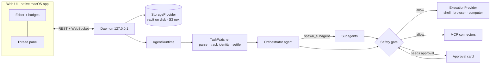

# Daily Do List

**A local-first, Obsidian-style markdown notes app whose daily note is a to-do list that an AI
actually does.** You write tasks the way you always have; an always-on orchestrator agent watches
the list, dispatches subagents to research, browse, draft and act, and reports back as comments on
each task. Anything risky — spending money, booking, sending messages, deleting data — waits for
your approval.

It's a *do* list, not a *to-do* list: the point is that things get done.


> **Status:** early (v0.1). The web app, the native macOS app ([`apps/macos`](apps/macos/README.md))
> and the local daemon work end to end; an iPhone app is planned (see
> [Cross-platform](docs/CROSS_PLATFORM.md)).

## Features

- **Obsidian-compatible notes.** Plain markdown files in a folder you own. Point it at an existing
  Obsidian vault and your daily-note folder, date format and template are picked up automatically.
- **Daily notes, built in.** `⌘⇧D` opens today's note (created from your template), `⌘⇧P` jumps to
  the previous existing daily note, `⌘⇧N` to the next.
- **Fast, minimal editor.** CodeMirror 6 with Obsidian-style live preview, clickable checkboxes,
  wikilinks, dark and light themes. Performance budgets are enforced in CI.
- **Vim mode, like Obsidian's.** The same engine (`@replit/codemirror-vim`) on the web and a
  faithful Swift port of it in the Mac app, both checked against 11,000+ recorded behaviors:
  motions, operators, text objects, visual block, registers, macros, marks, `:s`/`:g`/`:sort`,
  plus `:w`/`:q`/`:e <note>`, tab switching, system clipboard registers and a vimrc setting.
- **An agent that is always watching.** New or edited tasks in today's note are triaged within a
  couple of seconds of you finishing typing. The orchestrator answers quick questions itself,
  ignores chores it can't help with, and spawns subagents for real work.
- **Comments and threads on every task.** A status badge sits at the end of each task line; click
  it for the full thread: streamed agent messages, tool activity, artifacts (drafts, comparisons,
  research summaries), a live browser view and a computer-use view. Reply to steer the agent.
- **A separate safety evaluator.** Every tool call from every agent passes a policy → rules → LLM
  judge pipeline before it runs. Payments, bookings, outgoing messages, account changes,
  destructive commands and desktop control require your explicit approval; catastrophic actions are
  denied outright.
- **Real hands.** Subagents can use a real (headless) Chrome with its own profile, a shell in a
  per-task workspace, and — on macOS — the desktop via screenshots and mouse/keyboard.
- **Connectors via MCP.** Add any MCP server (Google Workspace, Playwright, GitHub, Notion, …) with
  the same `mcpServers` JSON you'd use in Claude Desktop or Cursor.
- **Providers everywhere.** Storage (local folder today, S3 next), sync targets, execution (local
  today, cloud next), agent harness ([Pi](https://github.com/badlogic/pi-mono) on OpenRouter, or the
  [Cursor CLI](https://cursor.com/cli) with your Cursor account) and connectors sit behind
  interfaces with a registry.

## Quick start

Requirements: **Node 24.4+**, **pnpm 10**, and Google Chrome (for browser-using agents).

```bash
pnpm install

# Add your OpenRouter key OUTSIDE the repo (the daemon reads it at startup):
mkdir -p ~/.daily-do-list && chmod 700 ~/.daily-do-list
echo "OPENROUTER_API_KEY=sk-or-..." >> ~/.daily-do-list/.env && chmod 600 ~/.daily-do-list/.env

pnpm dev          # daemon on 127.0.0.1:7331 + UI on http://localhost:5173
```

The default vault is `~/DailyDoList`. To use an existing Obsidian vault:

```bash
DDL_VAULT=~/Documents/MyVault pnpm dev
```

Other ways to run it:

| Command | What it does |
| --- | --- |
| `pnpm dev:mock` | Deterministic scripted agent (no API key, no network) — great for trying the UI |
| `DDL_AGENT_MODE=off pnpm dev` | Just the notes app, no agent |
| `pnpm build && pnpm start` | Production build served by the daemon at http://127.0.0.1:7331 |

The model defaults to **DeepSeek V4.1 Flash** via OpenRouter (`deepseek/deepseek-v4.1-flash`);
change it with `DDL_MODEL` or in Settings → Agent.

**Run the agent on the Cursor CLI instead.** Install the CLI and sign in with your Cursor account,
then pick the Cursor harness in Settings → Agent. Its model defaults to Claude Opus 5.5
(`claude-opus-5-5`); any model `agent models` lists works. The CLI's agent mode runs one preset per
model (Opus 5.5: medium effort, not fast), so a variant such as `claude-opus-5-5-high-fast` runs as
that preset. No OpenRouter key is needed; with one, it still powers the safety judge and web
search.

```bash
curl https://cursor.com/install -fsS | bash
agent login
```

The Cursor CLI's own tools (files, terminal, edits, web fetch) are switched off: agents use this
app's tools, served to the CLI over a local MCP endpoint and checked by the same safety gate.
Browser and computer use therefore work the same with both harnesses — they're this app's local
Chrome and (on macOS) desktop control, not Cursor's. Details: [Agent system](docs/AGENT_SYSTEM.md#5-the-cursor-cli-harness).

## macOS app

A native SwiftUI/AppKit app lives in [`apps/macos`](apps/macos/README.md). It starts and supervises
the daemon itself (or attaches to a running `pnpm dev`), opens today's note from an optional global
shortcut (⌃⌥⌘D), launches at login, and sends native notifications for approvals. It needs macOS 14+, and
Node.js 24.4+ for the daemon it manages.

```bash
pnpm --filter @ddl/daemon build
apps/macos/scripts/run-app.sh                                  # build and open (--demo: sample data, no daemon)
apps/macos/scripts/build-app.sh --release --with-daemon --zip  # a self-contained "Daily Do List.app"
```

## Keyboard shortcuts

| Shortcut | Action |
| --- | --- |
| `⌘⇧D` | Open today's daily note |
| `⌘⇧P` / `⌘⇧N` | Previous / next daily note |
| `⌘P` | Command palette |
| `⌘O` | Quick switcher (`⌘↵` creates the note) |
| `⌘N` | New note |
| `⌘⇧F` | Search the vault |
| `⌘\` | Toggle the agent panel |
| `⌘⇧A` | Agent inbox |
| `⌘,` | Settings |
| `⌘L` / `⌘↵` | Toggle checkbox on the current line |

On Windows/Linux use `Ctrl` instead of `⌘`.

## How the agent works



1. You type a task. The **TaskWatcher** parses the note, keeps a stable identity for each task
   while you edit it, and waits until you've stopped typing on that line.
2. The **orchestrator** (one agent session per day) sees the change in context — the whole list,
   sub-bullets, what's already running — and decides: answer it, ignore it, ask you, or delegate.
3. **Subagents** get a crisp goal and the minimal capabilities (web, browser, computer, shell,
   files, connectors), work in their own workspace, post progress to the task's thread, create
   artifacts, and finish with a summary.
4. The **safety evaluator** checks every single tool call. Risky ones pause the agent and show an
   approval card; nothing irreversible happens without you.

Deep dives: [Architecture](docs/ARCHITECTURE.md) · [Agent system](docs/AGENT_SYSTEM.md) ·
[Safety rules](packages/agent/src/safety/README.md) · [Connectors](packages/connectors/README.md) ·
[Execution providers](packages/agent/src/execution/README.md) · [Daemon & API](apps/daemon/README.md).

## Configuration

| Where | What |
| --- | --- |
| `~/.daily-do-list/.env` | Secrets (`OPENROUTER_API_KEY`) — never inside the repo |
| `~/.daily-do-list/config.json` | Daemon config: vault path, port, agent mode, sync target, execution provider |
| `~/.daily-do-list/mcp.json` | MCP connectors (`{ "mcpServers": { … } }`) |
| `<vault>/.daily-do-list/settings.json` | App settings (theme, editor, daily notes, agent), editable in the UI |
| Env vars | `DDL_HOME`, `DDL_VAULT`, `DDL_PORT`, `DDL_AGENT_MODE` (`live`/`mock`/`off`), `DDL_MODEL`, `DDL_CURSOR_CLI` (path to the Cursor CLI, if not on PATH or in `~/.local/bin`) |

Agent threads, artifacts and state live in the vault's hidden `.daily-do-list/` folder, so they
travel with your notes. Deleted notes go to the vault's `.trash/` folder.

## Performance

Responsiveness is a feature, measured on every change (production build, in-browser mock backend):

| Interaction | Budget | Measured |
| --- | --- | --- |
| Keystroke → paint, 2 000-line note (p95) | 16 ms | ~1.7 ms |
| Long tasks while typing | 0 | 0 |
| Open today's note (`⌘⇧D`) | 50 ms | ~5 ms |
| Switch tabs | 30 ms | ~8 ms |
| Open a task thread | 100 ms | ~15 ms |
| App interactive (first load) | 800 ms | ~105 ms |

Plus micro-benchmarks for the hot paths (task parsing/tracking, live preview, vault listing/search)
and a bundle-size budget. See [docs/PERFORMANCE.md](docs/PERFORMANCE.md).

## Development

```bash
pnpm lint        # Biome
pnpm typecheck   # TypeScript 7 across all packages
pnpm test        # Vitest (≈1 500 tests)
pnpm bench && pnpm bench:check
pnpm e2e && pnpm e2e:perf      # Playwright functional + performance budgets
pnpm eval:mock   # deterministic agent evals (CI); `pnpm eval` hits the real model
pnpm check:secrets
```

Repository layout, conventions and invariants are documented in [AGENTS.md](AGENTS.md) (written
for AI coding agents, useful for humans). Contribution guide: [CONTRIBUTING.md](CONTRIBUTING.md).
CI details: [docs/CI.md](docs/CI.md).

## Security & privacy

- The daemon listens on `127.0.0.1` only, requires a bearer token, and rejects foreign
  `Host`/`Origin` headers.
- Agents can act on your machine; the safety gate is mandatory for every tool call and fails
  closed. Review approval cards before approving.
- When the agent is on, the text of your daily notes (and anything agents read) is sent to the
  configured model provider (OpenRouter by default, Cursor with the Cursor CLI harness).
- Report vulnerabilities privately — see [SECURITY.md](SECURITY.md).

## Roadmap

- iPhone app (native Swift, reusing the macOS app's packages; talking to your Mac or a cloud
  daemon) — [plan](docs/CROSS_PLATFORM.md)
- S3 storage + sync provider; cloud execution provider (remote sandbox for browser/computer use)
- Watching more than daily notes (projects, weekly notes); scheduled check-ins
- Memory / user profile so the assistant gets more personal over time

## License

[MIT](LICENSE). Builds on [Pi](https://github.com/badlogic/pi-mono), and adapts pieces of
[OpenClaw](https://github.com/openclaw/openclaw) and
[Hermes Agent](https://github.com/NousResearch/hermes-agent) — see
[THIRD_PARTY_NOTICES.md](THIRD_PARTY_NOTICES.md).
