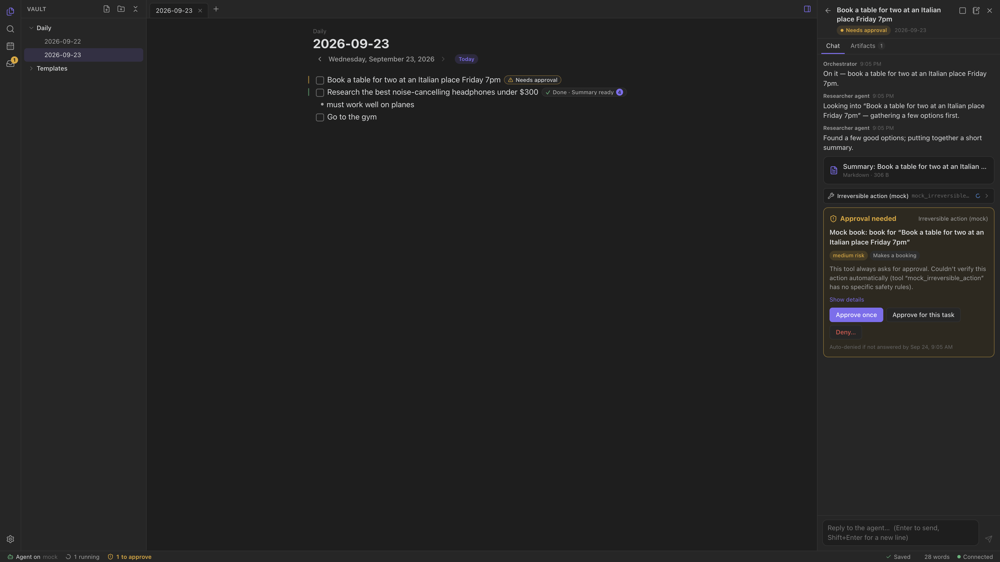

# Daily Do List for macOS

A native SwiftUI/AppKit client for the local Daily Do List daemon. The Mac app does what the web UI
does (daily notes, the editor with agent badges, threads, approvals, search, settings), and adds
what only a native app can: it starts and supervises the daemon itself, opens today's note from a
global shortcut, launches at login, shows agent activity in the menu bar and the Dock, and sends
native notifications for approvals.



> Screenshot placeholder. It shows the web UI until native screenshots exist.

## Requirements

- macOS 14 (Sonoma) or later. Builds target the building Mac's architecture (the CI artifact is
  Apple silicon).
- **Node.js 24.4+** for the managed daemon. The app runs the daemon with the system Node; it
  doesn't bundle Node.
- To build: Swift 6 with the Command Line Tools (`xcode-select --install`) or Xcode. Building the
  daemon or a bundled daemon also needs pnpm 10 (see the root [README](../../README.md)).

## Quick start

```sh
pnpm install && pnpm --filter @ddl/daemon build   # the daemon the app will run
apps/macos/scripts/run-app.sh                      # build (debug) and open the app
apps/macos/scripts/run-app.sh --demo               # in-memory demo data, no daemon, no Node
```

`run-app.sh --env DDL_AGENT_MODE=mock` passes environment variables to the app, and from there to
the daemon it starts (here: the scripted agent, no API key).

## Layout

The app is one SwiftPM package (the shell) that composes independent local packages. Each package
builds and tests on its own. The packages marked "iOS" are Foundation-only and meant for the
future iPhone app too.

| Path | Responsibility |
| --- | --- |
| `Package.swift`, `Sources/DailyDoList` | The executable: `@main` and nothing else. |
| `Sources/DailyDoListApp` | The app shell: scenes, `AppModel`, stores, workspace, settings panes, commands, the command palette. |
| `Sources/DailyDoListApp/System` | OS integration: launch at login (`SMAppService`), the global hotkey (Carbon), shortcut parsing, conflicts with macOS shortcuts. |
| `Packages/DailyDoListModels` (iOS) | Swift mirror of the wire protocol (`packages/core/src/protocol.ts`), checked against the `@ddl/contract` fixtures. |
| `Packages/DailyDoListClient` (iOS) | `DaemonClient`: `HTTPDaemonClient` (REST + WebSocket, reconnects and resyncs) and `InMemoryDaemonClient` (the demo and test fake). |
| `Packages/DailyDoListDomain` (iOS) | Pure domain logic ported from `@ddl/core`: dates and daily notes, task parsing and tracking, line anchors, agent-line markers, three-way merges, wikilinks, paths, fuzzy matching. |
| `Packages/DailyDoListEditor` | The TextKit markdown editor: live preview, clickable checkboxes, agent badges, and vim mode (it hosts `DailyDoListVim`). |
| `Packages/DailyDoListVim` (iOS) | Vim mode: a port of the web editor's vim.js and its CodeMirror 6 adapter, checked against the web app's vim vectors; hosts implement `VimEditor` ([README](Packages/DailyDoListVim/README.md)). |
| `Packages/DailyDoListAgent` | Agent state and UI: inbox, threads, approval cards, artifacts, notifications, menu bar, Dock badge. |
| `Packages/DailyDoListDaemon` | `DaemonSupervisor`: finds Node and the daemon, attaches or launches, health-checks, restarts, stops. |
| `IntegrationTests/` | End-to-end tests against the real daemon (a separate package). |
| `Resources/` | `Info.plist.template` and the rendered 1024 px icon (`AppIcon-1024.png`). |
| `scripts/` | `test.sh`, `build-app.sh`, `run-app.sh`, `make-icon.swift`. |

## Commands

| Task | Command |
| --- | --- |
| Build (debug) | `swift build --package-path apps/macos` |
| Run | `apps/macos/scripts/run-app.sh [--demo] [--release] [--with-daemon] [--env VAR=value]` |
| Test every package and the shell | `apps/macos/scripts/test.sh` |
| Test one package | `apps/macos/scripts/test.sh DailyDoListDaemon` (or `app`) |
| Filter tests | `apps/macos/scripts/test.sh DailyDoListModels -- --filter ContractFixture` |
| Integration tests | `pnpm --filter @ddl/daemon build && apps/macos/scripts/test.sh integration` |
| Format / lint Swift (swift-format, `.swift-format`) | `pnpm lint:fix` / `node scripts/lint.mjs --all --only swift` |
| Package the app | `apps/macos/scripts/build-app.sh [--release] [--with-daemon] [--zip] [--output DIR] [--open]` |
| Re-render the icon source | `swift apps/macos/scripts/make-icon.swift --png apps/macos/Resources/AppIcon-1024.png` |

## Calm by default

- **One grid.** The window has no title bar: the sidebar, the tabs and the agent panel each start
  with a 40 pt header row (the traffic lights sit in the sidebar's, centered by an empty compact
  toolbar), and their bottom lines meet. Every line is the same one-pixel separator; panes
  resize by dragging the line between them (double-click restores the default width). Empty
  header space drags the window like a title bar. Layout rules: `Views/Chrome/PaneLayout.swift`.
- **Daily notes** are titled by their date ("Thursday, September 24"; the year only when it isn't
  this year's), with "‹ Today ›" at the end of the title row. The date isn't editable: **Rename
  Note…** on a daily note renames it in the file explorer. Tabs and the sidebar keep showing the
  file name.
- **The status line** under the note has no bar or border and only shows what needs attention:
  the save state while the note isn't saved, the connection while it isn't connected (a small
  "Demo" marker in demo mode), and the agent's mode when it isn't `live`. The agent item says
  what the agent can do right now: "Agent on" / "Agent paused" (click to toggle), "Agent off",
  or "Agent unavailable" when the daemon reports a problem (click for the reason and a way to
  Settings → Agent). It never shows "on" next to a problem.
- **Agent badges** are loud only when they need you, and move gently (fade-ins, crossfades, the
  triaging pulse, checkmarks popping in) unless Reduce Motion is on. See the
  [editor README](Packages/DailyDoListEditor/README.md#behavior).
- **Dark by default**, in the app's blue palette (the web app's `--ddl-*` tokens: `Theme`,
  `AgentTheme`, `EditorColors`). Settings → Appearance switches to light or the system's.

## The agent in your notes

- **Lines the agent wrote** end with `%%agent:<thread>%%` (an Obsidian comment). The editor hides
  the marker, draws the line in the agent color and ends it with a sparkle that opens the thread
  (the marker shows faintly on the line you're editing and in source mode).
- **Threads anchored to a line** that isn't a task (a question written as prose) put their badge on
  that line and give it a soft accent band with a bar at its left edge.
- **Citations**: in a thread, `[1](url)` links are small chips, and hovering a link shows a card
  (the page's title, hostname and snippet from the thread's `sources`, never fetched) or, for a
  `[[wikilink]]`, the note's first lines. In the editor, links show the same preview as a tooltip.
- **Merging**: when the agent (or anyone) changes a note you have unsaved edits in, the two are
  merged line by line (`TextMerge`); the editor only receives their lines, your caret and undo
  stay, and the result is saved on top of their version. Changes to the same lines keep yours and
  save theirs as a conflict copy, as before.

## Vim mode

Turn it on with **Vim key bindings** in Settings → Appearance, View → Vim Key Bindings, or "Toggle
vim key bindings" in the command palette. The editor then does what the web app's vim mode does,
which is Obsidian's: `DailyDoListVim` is a port of the same engine (vim.js), and the web app's
11,491 recorded vim behaviors replay through the real Mac editor in the tests.

- **Looks:** a block cursor in normal, visual and replace mode (an outline while the window isn't
  active), the command line (`:`, `/`, `?`) and vim's messages under the editor, highlighted
  search matches, and the mode in the status bar with the keys of a command being typed (`2d`,
  `"a`) and `recording @q`.
- **App commands:** `:w`, `:wa`, `:q`, `:q!`, `:qa`, `:wq`, `:x`, `:wqa`, `:xa`, `:e <note>`
  (a bare `:e` opens the quick switcher), `:tabe[dit] <note>`, `:tabnew`, `:tabc[lose]`,
  `:tabn[ext] [N]`, `:tabp[revious]`/`:tabN[ext] [N]`, `:bn`, `:bp`, `:bN`, `:bd`, `gt`/`gT`
  (`3gt` goes to the third tab), and `:obcommand <id>` for any palette command. It takes the
  app's ids (`daily.today`, `editor.vim`) or the web app's (`daily:today`, `panel:left`), so one
  vimrc works in both apps. A command that can't run here says so in the command line.
- **Clipboard:** `"+` and `"*` are the system clipboard; `:set clipboard=unnamed` (or
  `unnamedplus`) makes plain `y`, `d` and `p` use it too.
- **vimrc:** Settings → Appearance shows a vimrc editor while vim is on. It runs at launch and
  whenever it changes (one ex command per line, `"` comments, `let mapleader = …`, and
  Obsidian's `exmap name command`); rejected lines are listed under it with vim's message.
- **Keys:** ⌘ shortcuts keep working in every mode. In normal and visual mode vim gets the Ctrl
  keys it binds (and those a vimrc maps) before the menus, and no key reaches the text view or
  the press-and-hold accent popup. In insert mode, keys vim doesn't use keep their macOS
  behavior, so list continuation, Tab and the Ctrl-A/Ctrl-E line motions still work. While an
  input method is composing, keys go to it.
- **Undo:** `u`, `<C-r>`, ⌘Z and ⇧⌘Z share one history per note, grouped the way the web app
  groups it (one step per command, typing merged until the cursor moves).
- **Notes and windows:** one vim instance serves every editor, so registers, macros, search and
  command history, mappings and options are shared. Each note you open starts in normal mode with
  its own marks, and switching notes never carries a pending command or a visual selection over.

## Demo mode

`--demo` (or `DDL_DEMO=1`) runs the whole UI against `InMemoryDaemonClient`: sample notes and a
simulated agent that streams, asks for approvals and finishes tasks in real time. There's no
daemon, no Node and no network, which makes it good for trying the app, UI work and screenshots.
Connection settings apply on the next normal launch.

## Managed vs. external daemon

Settings → General → Daemon chooses how the app gets a daemon.

- **Managed** (default): `DaemonSupervisor` attaches to a daemon that already answers on the port
  (for example `pnpm dev`) and never stops it. Otherwise it launches its own. Settings default to
  what a terminal would use (`DDL_HOME`, `DDL_VAULT`, `DDL_PORT`, `DDL_AGENT_MODE` from the
  environment, the port from `$DDL_HOME/config.json`), with overrides from Settings.
- **External**: connect to a daemon at a URL, with the token from `$DDL_HOME/daemon-token`.

How a managed daemon is found and run:

1. **Node:** `DaemonLaunchConfiguration.nodePath` if set, `DDL_NODE`, every `node` on your login shell's PATH
   (`/bin/zsh -lc`), the inherited PATH, `/opt/homebrew/bin`, `/usr/local/bin`, mise and Volta
   shims, then nvm, fnm and asdf. The first one reporting `node --version` ≥ 24.4.0 wins; an older
   Node earlier on the PATH doesn't hide a newer one. The answer (with the login shell's PATH) is
   remembered in `$DDL_HOME/node-location.json` while that binary is unchanged, so later launches
   skip the ~300 ms lookup; it's re-checked in the background after each launch and forgotten if
   a launch from it fails.
2. **Daemon:** `daemonEntry` if set, `DDL_DAEMON_ENTRY`, the copy bundled in the app
   (`Contents/Resources/daemon/dist/main.js`), then a repository checkout (`DDL_REPO_ROOT`, or
   walking up from the app and from the current directory).
3. **Launch:** `node <entry>` in the daemon's package directory, with your environment plus the
   daemon settings. Its PATH starts with Node's folder and includes your login shell's PATH, so
   connectors started with `npx` or `uvx` work when the app was opened from Finder. The supervisor
   waits up to 20 s for the token file and a healthy `GET /api/health`.
4. **Supervision:** an unexpected exit restarts the daemon after 1, 2, 4, 8… s (capped at 30 s).
   After 5 failures within 2 minutes it gives up and shows the daemon's last output. An attached
   daemon is health-checked every 5 s; if it goes away, the app starts its own.
5. **Stop:** SIGTERM to the daemon's process group, then SIGKILL after 5 s. Quitting the app stops
   the managed daemon. If the app crashes, the daemon notices its stdin closing and shuts itself
   down (a small `--import` preload), so no orphan lingers.

Settings → General → Status shows the daemon's version, API version and vault, and its log. The
supervisor keeps the last 1,000 lines; you can copy or clear them there. **Restart Daemon**
restarts a managed daemon in place, and connected clients reconnect and resync.

## Packaging

`scripts/build-app.sh` assembles `Daily Do List.app` in `apps/macos/build/` (gitignored):

- `swift build` of the `DailyDoList` product (`--release` for an optimized build).
- `Contents/Info.plist` from `Resources/Info.plist.template`: bundle id `app.dailydolist.mac`,
  version from `apps/macos/VERSION` if present, else the root `package.json`, and build number from
  the git commit count (else a timestamp). It also sets macOS 14 minimum, local-networking ATS, and
  no sudden termination.
- `Contents/Resources/AppIcon.icns`: `make-icon.swift` renders the icon (a blue squircle with a
  white checkbox) at every size with CoreGraphics, then `iconutil` packs it. The result is cached
  in `build/.work` until the script changes.
- `--with-daemon`: `pnpm --filter @ddl/daemon build`, then
  `pnpm --filter @ddl/daemon deploy --prod --legacy --ignore-scripts` into a scratch folder. pnpm 10
  refuses a plain deploy without `inject-workspace-packages`, and `--legacy` keeps the lockfile
  as is. `dist/`, `package.json` and the production `node_modules` (about 200 MB) are copied into
  `Contents/Resources/daemon/`. Workspace packages (already inlined into `dist/`), bin
  shims, pnpm metadata and dangling links are removed. The bundled daemon still needs the
  system's Node 24.4+.
- Ad-hoc signature (`codesign --force --deep --sign -`), verified with
  `codesign --verify --deep --strict`. `--zip` writes `Daily Do List.zip` with `ditto`.

SwiftPM resource bundles are copied into `Contents/Resources`. The generated `Bundle.module`
accessor looks next to the `.app` instead, where codesign forbids files, so packages should load
resources through `Bundle.main.resourceURL`.

An ad-hoc signed app isn't notarized. A downloaded copy (for example the CI artifact) is
quarantined: right-click → Open, or `xattr -dr com.apple.quarantine "Daily Do List.app"`.

## Permissions

| Feature | What macOS needs |
| --- | --- |
| Notifications (approval requests, finished tasks) | The standard notification prompt on first use; manage it in System Settings → Notifications. |
| Launch at login | Only works from a signed `.app` (`build-app.sh`; a `swift run` build explains why it's unavailable). When macOS says it needs approval, the toggle offers **Open Login Items Settings…**. |
| Global shortcut (off by default; default ⌃⌥⌘D: open today's note) | No permission (Carbon hotkeys). ⌃⌥⌘D is free on a stock Mac; ⌥⌘D would clash with macOS's own "Turn Dock hiding on/off". The app detects clashes with common system shortcuts and says which setting to turn off, or pick another shortcut in Settings → General. |
| Computer use and browser automation by agents | The daemon is the app's child process, so Accessibility and Screen Recording prompts name **Daily Do List**. Ad-hoc signatures change with every build, so macOS may ask again after rebuilding. |

## Troubleshooting

| Symptom | What to do |
| --- | --- |
| "Node.js 24 is required" | Install Node 24 (`brew install node`, or nodejs.org), or set `DDL_NODE` to a Node 24.4+ binary (for apps opened from Finder: `launchctl setenv DDL_NODE /path/to/node`, then relaunch). The message lists what was found. |
| "The daemon wasn't found" | Run `pnpm --filter @ddl/daemon build` in the checkout, build the app with `--with-daemon`, or set `DDL_DAEMON_ENTRY`. |
| "The daemon rejected this app" | A daemon on the port uses another token: it was started with a different `DDL_HOME`, or `daemon-token` was rotated while it ran. Restart that daemon, or match `DDL_HOME` in Settings. |
| "The daemon's port is taken" | Something that isn't the daemon listens on 127.0.0.1:7331. Quit it, or choose another port (Settings or `DDL_PORT`). `lsof -nP -iTCP:7331 -sTCP:LISTEN` shows who. |
| "This app and the daemon don't match" | The major API versions differ (`/api/health` → `apiVersion`). Update whichever side is older; rebuild the daemon after pulling. |
| The daemon keeps crashing | The failure shows its last output; Settings → General → Status → Daemon log has more. Run `node apps/daemon/dist/main.js` in a terminal to see it directly. |
| The shortcut does nothing | Check the warning under the shortcut setting (a macOS shortcut may take precedence), then System Settings → Keyboard → Keyboard Shortcuts. |
| Launch feels slow | Run the binary with `DDL_BOOT_TRACE=1` (`DDL_BOOT_TRACE=1 "Daily Do List.app/Contents/MacOS/DailyDoList"`): each boot phase prints to stderr with the milliseconds since the process started. A warm launch reaches `app: ready` in ~500 ms (see `docs/PERFORMANCE.md`). |

## Testing

- **Unit tests** live in each package (`Tests/`) and use Swift Testing. `scripts/test.sh` runs
  them. With only the Command Line Tools there's no XCTest and plain `swift test` can't find
  `Testing.framework`, so the script adds the framework and rpath flags. With Xcode selected it
  adds nothing.
- **Fakes first.** Supervisor logic runs against injected fakes (process launcher, health
  checker, files, commands, and a clock whose sleeps finish instantly), so crash loops, backoff,
  timeouts and stop escalation are tested in milliseconds. A few tests start real processes: a
  tiny fake daemon script (`Packages/DailyDoListDaemon/Tests/.../Fixtures/fake-daemon.mjs`).
- **Integration tests** (`IntegrationTests/`, `scripts/test.sh integration`): `DaemonSupervisor`
  launches the real `apps/daemon/dist/main.js` (mock agent, temporary `DDL_HOME` and vault, a free
  port) and the tests drive `HTTPDaemonClient`. They cover REST (daily notes from templates,
  optimistic concurrency and 409s, soft deletes, folders, search, settings), WebSocket events
  (hello, echo tagging, external edits), agent flows (streamed threads, artifacts, approve, deny,
  retry, cancel), and a supervisor restart mid-stream (reconnect + resync). They're skipped with
  a message when Node 24.4+ or the built daemon is missing.
- **Vim**: `DailyDoListVim` replays the web app's vim vectors against its reference buffer, and
  `DailyDoListEditor` replays all of them again through the real editor, with live preview both
  off and on. Vim-mode tests drive the editor with real `NSEvent`s (typing, undo grouping, IME,
  prompts, the block cursor's pixels, mouse selections, paste, badges, switching notes), and
  `VimAppTests` cover ex commands, the status bar, the vimrc and the clipboard in the app. See the
  [editor README](Packages/DailyDoListEditor/README.md#vim-mode).
- **CI**: `.github/workflows/macos.yml` builds the daemon, runs every package's tests and the
  integration tests, builds a release app with the bundled daemon, and uploads the zip.
- The web UI's e2e and perf budgets don't cover this app. Check UI changes by hand
  (`run-app.sh --demo` is quickest).
